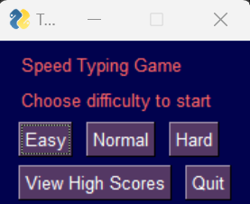
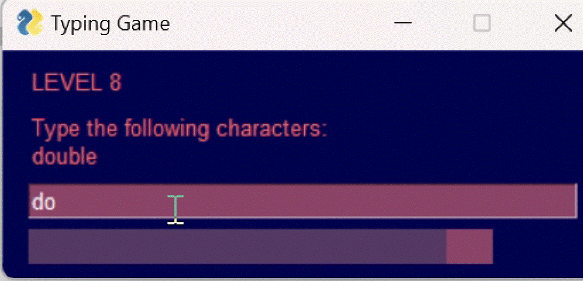
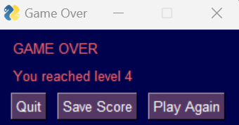
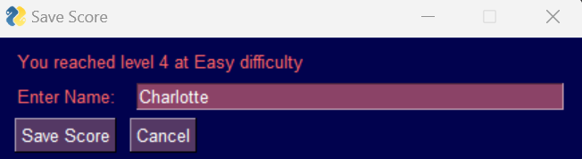
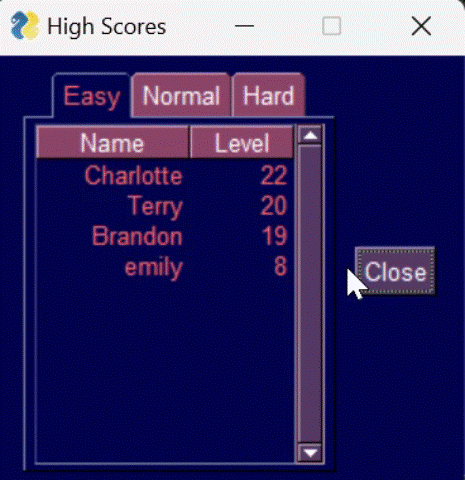

## Speed Typing Game

A mini-game to test typing speed and accuracy. A just-for-fun project I made to learn the basics of PySimpleGUI.

### Main Menu
When starting the game, the user is given the options to select a difficulty to begin playing or view the high score leaderboard.

### Gameplay
The gameplay consists of levels where the user has to correctly type a given random word(s) and press enter before the timer runs out. The time given per level is based on the following formula:

$$ time = length(word) * 100 * {1 \over max(level, level-3)} + difficulty \space factor$$

As the levels progress the time allowed per character decreases. Additionally, the lengh of the word and number of words to type increases with the levels. From level 15, there is a chance for multiple words to be generated. The difficulty factor is a base amount of time decided by the difficulty level at the start of the game as follows:

* Easy = 400ms
* Normal = 200ms
* Hard = 50ms

### Game Over
Game Over occurs when either a word(s) is typed incorrectly or the timer runs out.

### High Scores
The game prompts the user if they want to save their high score at game over. This asks for the users name and saves the score to a dataframe. Closing the application will save the dataframe to [highscores.txt](highscores.txt). 

Highscores are overwritten if the name entered already has a lower score for that difficulty in the dataframe.

From the main menu the user can view the leaderboard of highscores. This is broken down by difficulty across 3 tabs.

